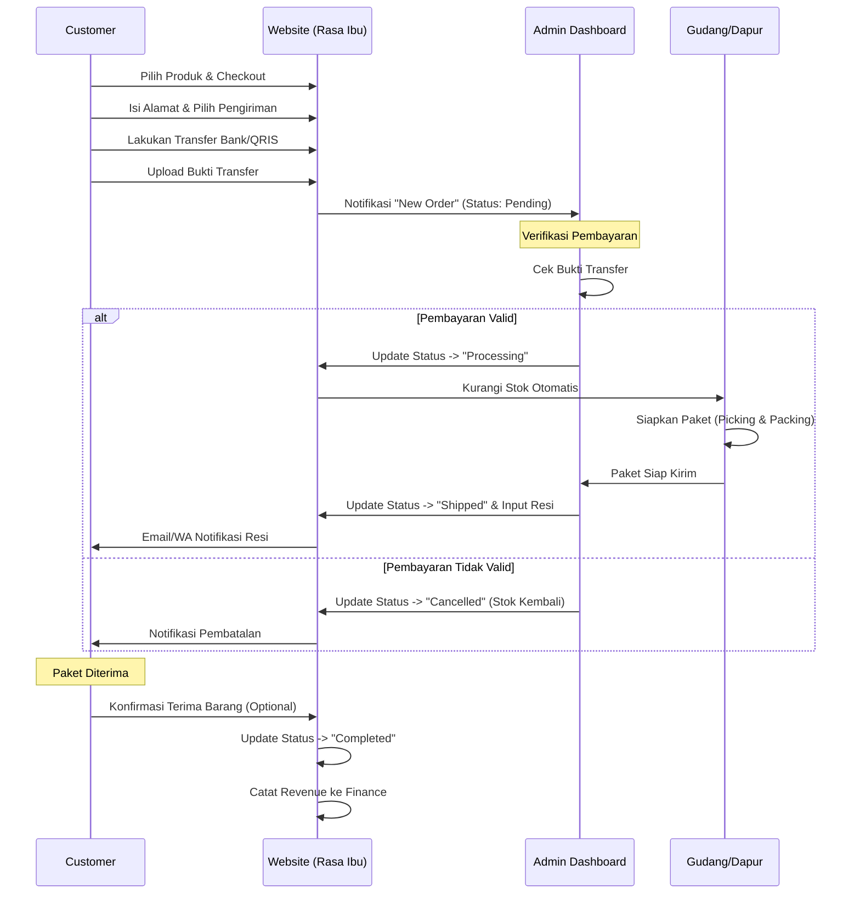

# 🔄 Alur Proses Bisnis (SOP)

Dokumen ini menjelaskan alur kerja utama dalam sistem Achiera Web.

## 1. Alur Pemesanan Pelanggan (Order Flow)
Bagaimana pesanan masuk dan diproses hingga sampai ke tangan pelanggan.

---

## 2. Alur Pembelian & Stok (Procurement Flow)
Bagaimana menjaga stok agar tidak habis.

1.  **Analisis Kebutuhan**:
    *   Sistem AI mengecek stok saat ini.
    *   Membandingkan dengan prediksi penjualan minggu depan.
    *   Jika stok < Safety Stock, AI memberikan alert "Low Stock".

2.  **Pembuatan PO (Purchase Order)**:
    *   Admin Logistik membuka menu **Inventory > Purchase Orders**.
    *   Membuat PO ke Supplier untuk bahan yang kurang.
    *   Status PO: `Draft` -> `Sent`.

3.  **Penerimaan Barang (Goods Receipt)**:
    *   Supplier mengirim bahan baku.
    *   Staf Gudang mengecek fisik barang.
    *   Admin update PO menjadi `Received`.
    *   **Stok bertambah otomatis** di sistem.

---

## 3. Alur Berlangganan Katering (Subscription Flow)

1.  **Pendaftaran**:
    *   Customer memilih paket langganan (misal: "Paket Sehat 7 Hari").
    *   Customer membayar lunas di awal.

2.  **Penjadwalan Otomatis**:
    *   Sistem men-generate "Jadwal Pengiriman" harian untuk customer tersebut.
    *   Setiap pagi (misal jam 05:00), sistem membuat list pengiriman hari itu.

3.  **Eksekusi Harian**:
    *   Dapur melihat "Subscription Delivery List" hari ini.
    *   Masak & Kirim.
    *   Admin menandai pengiriman hari ini `Delivered`.
    *   Sisa kuota langganan customer berkurang 1.

4.  **Renewal**:
    *   H-1 sebelum paket habis, sistem mengirim notifikasi ke user untuk perpanjang.
